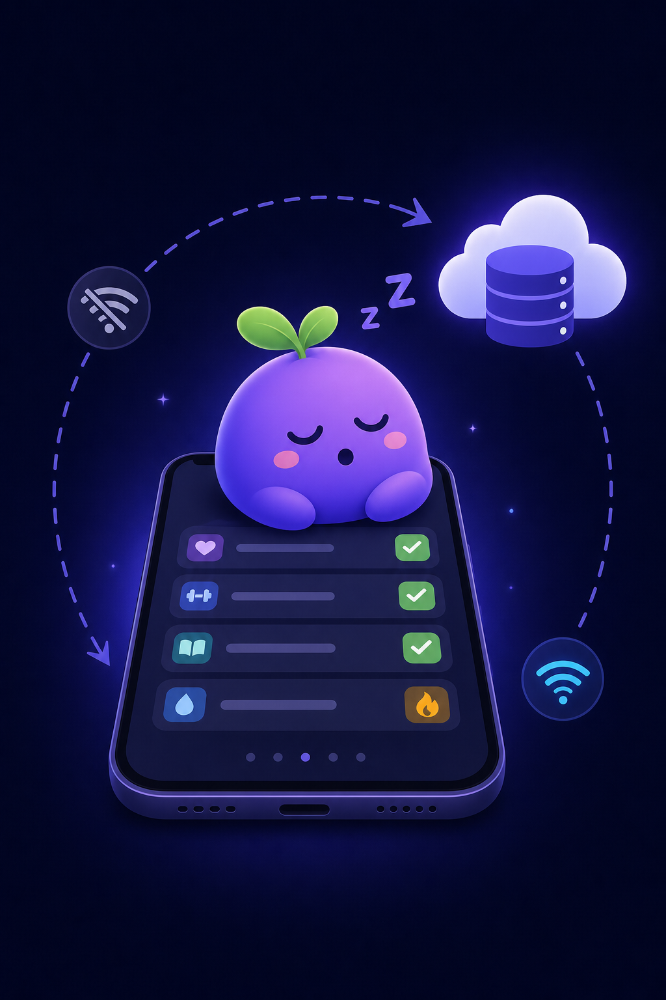

# HabitFlow Mobile (Android & iOS)

HabitFlow ships as a **Capacitor native shell** around the existing Next.js app.
That means every feature — dashboard, habits, analytics, themes, settings — works
identically on web, Android and iOS from one codebase, and the binaries stay tiny
(only the Capacitor runtime ships; no duplicated app code).

```
┌─────────────────────────────┐
│ Android / iOS app (WebView) │  ← native shell (this folder, mobile/)
│   loads https://your-server │  ← Next.js full-stack app (repo root)
└─────────────────────────────┘
```

> ⚠️ The mobile app needs a **reachable HabitFlow server** (your PC on the same
> Wi-Fi for testing, or a hosted deployment for everyday use). It is not an
> offline app — there is no bundled web build inside the APK.

---

## 1. Prerequisites

| Platform | You need |
| --- | --- |
| Android | [Android Studio](https://developer.android.com/studio) (SDK + Gradle come with it) |
| iOS | macOS with [Xcode](https://developer.apple.com/xcode/) (Apple Developer account only needed for device distribution / TestFlight) |
| Both | The HabitFlow server running and reachable from the phone |

```powershell
cd mobile
npm install
```

## 2. Point the app at your server

Edit `mobile/capacitor.config.json`:

```json
"server": { "url": "http://192.168.1.10:3000", "cleartext": true }
```

- **Testing on the same Wi-Fi:** use your PC's LAN IP (find it with `ipconfig` on Windows, look for *IPv4 Address*), then start the server so phones can reach it:

  ```powershell
  # repo root (NOT mobile/)
  npm run dev -- -H 0.0.0.0
  ```

  Verify from the phone's browser first: `http://<PC-IP>:3000` should load the login page.
- **Production:** deploy the app (Railway / Render / a VPS…) and set
  `"url": "https://your-domain.com"` — `cleartext` can be removed for https.

Then sync once:

```powershell
cd mobile
npx cap sync
```

## 3. Run the Android app

1. `npx cap open android` (opens Android Studio; first run downloads Gradle, a few minutes)
2. Pick a device: an emulator, or your phone with **USB debugging** enabled
3. Press ▶ **Run**

**Icon, splash, name & id are already configured** (`app.habitflow.mobile`). The app
is the full HabitFlow experience — sign in with the demo account and everything works.

### Build an APK to share / install

#### Option A — in the cloud (easiest, no Android Studio needed)

The repo ships a ready-made GitHub Actions builder — it just needs a **one-step
activation** (workflow files can only be added by the repo owner):

1. Move **`apk-builder.yml`** (repo root) to **`.github/workflows/android-apk.yml`**:
   - *On GitHub:* open `apk-builder.yml` → copy → **Add file → Create new file** →
     name it `.github/workflows/android-apk.yml` → paste → **Commit**.
   - *Locally:* `mkdir .github\workflows` then `git mv apk-builder.yml .github/workflows/android-apk.yml`, `git push`.
2. Go to **Actions → Build Android APK → Run workflow**. Optionally type your
   **server URL** (e.g. `http://192.168.1.25:3000` — your PC's LAN IP, or your
   hosted https URL) — it gets baked into the app automatically.
3. When the run turns green (~5 min), download **`habitflow-debug-apk`** from the
   run's *Artifacts* section, unzip, and copy the APK to your phone
   (USB / WhatsApp / Drive / email).
4. On the phone: tap the APK → allow *"Install unknown apps"* for your
   browser/files app → **Install**. Debug APKs are signed with the standard debug
   key, so they install on any Android device — no Play account needed.

From then on, every push that touches `mobile/` auto-builds a fresh APK artifact
for you.

#### Option B — locally with Gradle / Android Studio

From Android Studio: **Build → Build Bundle(s)/APK(s) → Build APK(s)** (debug).
For the small **release** build:

```powershell
cd mobile\android
.\gradlew.bat assembleRelease        # APK:  android\app\build\outputs\apk\release\app-release.apk
.\gradlew.bat bundleRelease          # AAB:  ...\bundle\release\app-release.aab   (for Play Store)
```

Release builds already ship with **R8 minification + resource shrinking + JS-bridge
ProGuard rules** (see `android/app/build.gradle` + `proguard-rules.pro`).
You will be asked for a signing keystore for release; a debug keystore works for
personal side-loading:

```powershell
# one-time: settings.gradle-style config — simplest is to add to android/app/build.gradle:
# signingConfigs { release { storeFile file("debug.keystore"); storePassword "android"
#                            keyAlias "androiddebugkey"; keyPassword "android" } }
# release { signingConfig signingConfigs.release ... }
```

## 4. Run the iOS app (needs a Mac)

```bash
cd mobile
npx cap open ios        # opens Xcode
```

- Select the **App** scheme and a simulator or device → ▶
- For a real device / TestFlight: set your **Team** in Xcode → Signing & Capabilities.
- Archive for distribution: **Product → Archive → Distribute App**.

## 5. APK / binary size — what we did and what to expect

| Technique | Status | Effect |
| --- | --- | --- |
| Capacitor shell (no bundled web code) | ✅ built-in | APK is ~5–8 MB instead of 30–60 MB |
| R8 `minifyEnabled` + `shrinkResources` | ✅ enabled | strips unused Java/Kotlin code & resources |
| JS-bridge ProGuard rules | ✅ included | keeps Capacitor bridge safe under R8 |
| No extra Capacitor plugins | ✅ by design | every plugin adds MBs — only core ships |
| Play App Bundle (AAB) | recommended | store serves each device only its slice |

Reference numbers (typical): debug APK ≈ 8–10 MB, release APK ≈ 5–7 MB,
Play-served download from AAB can be smaller still.

## 6. Offline mode (track habits without network)



HabitFlow keeps working when the phone loses signal — the same code powers the
browser, Android and iOS versions:

- **App opens offline.** A service worker (`public/sw.js`) caches the app shell,
  static assets and pages you've visited, so the app still loads with no network
  (and shows a branded Bloop page for screens never opened before).
- **Check-ins queue on the device.** Toggling a habit while offline writes the
  *absolute state* (`{ habit, date, completed }`) to a small on-device outbox
  (`localStorage`). The row gets an amber **"queued"** badge, and today's
  checklist still feels instant.
- **Auto-sync to the online database.** The moment connectivity returns, the
  outbox replays to the server in order (`src/lib/offline.js → flushQueue`),
  the floating pill flashes **"All changes synced"**, and streaks/totals
  reconcile from the server — which always stays the source of truth.
- Replay is **idempotent**: the entries API is an upsert by `(habit, date)`, so
  retried syncs can't double-apply or fight with edits made on other devices.
- Cached pages are wiped on sign-out; anything still queued is kept so it can
  sync on the next sign-in rather than being lost.

**Honest limits of v1**

| Limit | Why |
| --- | --- |
| Full offline-open needs **https** (or localhost) | Service workers require a *secure context*. Over plain `http://LAN-IP`, queueing still works on pages already loaded, but a cold app start offline won't. Deploy with https (or test on localhost) for the full experience. |
| Offline writes = **check-ins only** | Habit creation/edits, notes, reflections and challenge actions still need the server (roadmap: extend the outbox to them). |
| Analytics shown offline are as-of last visit | Cached pages are snapshots; they refresh once you're back online. |

## 7. Regenerating icons & splash

Crisp icons/splash are generated programmatically (no designer needed):

```bash
pip install pillow
python3 scripts/generate-mobile-assets.py   # from the repo root
```

## 8. Notes & limitations

- **Branching:** this work landed on `arena/019f82ef-habit-tracker`. To isolate it
  into your own branch: `git checkout -b mobile-app && git push -u origin mobile-app`.
- **Offline mode** (fully self-contained app with local DB) is possible but would
  require re-architecting the backend for the device — out of scope here.
- The session cookie flows through the WebView exactly like the browser, so
  sign-in, themes and settings behave identically.
- `mobile/www/index.html` is the branded fallback shown when the server is unreachable.
